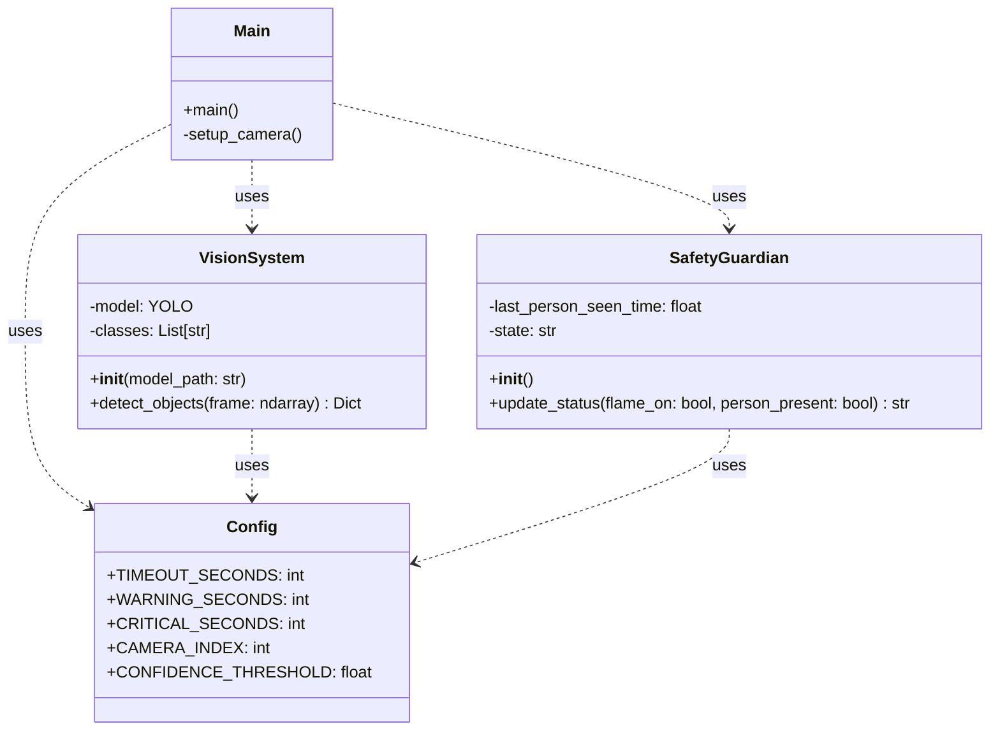
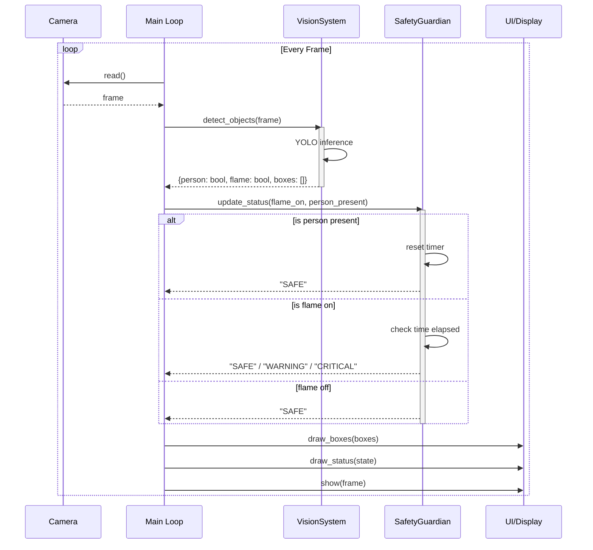

# System Architecture

## Class Diagram

This diagram illustrates the structure of the *Kitchen Guardian* system, showing the relationships between the main execution loop, the vision system, and the safety state machine.

## Sequence Diagram

This diagram shows the runtime flow of a single frame processing cycle within the application loop.

